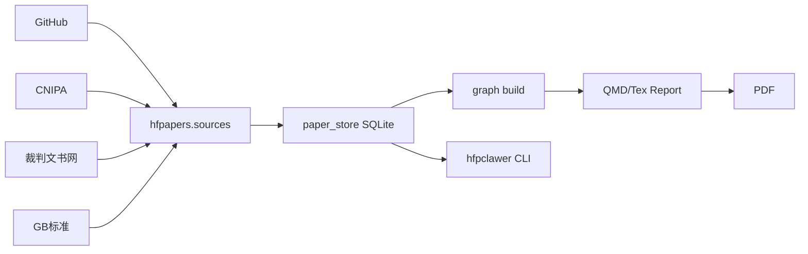

# hfpclawer Multi-Source Document Adapters — Implementation Plan

> **Version:** v0.14.0 (Phase A + Phase B)
> **Author:** Hermes Agent
> **Date:** 2026-07-17

**Goal:** Expand hfpclawer from arXiv/paper-only ingestion to multi-source knowledge discovery — patents, legal, standards, GitHub, financial — enabling Hermes Agent to build domain knowledge bases for non-researcher users.

**Architecture:** New `hfpapers/sources/` package following existing `searcher_registry.py` adapter pattern. Each source = one file, same interface. Paper store reuses existing SQLite + cross-ref.

**Version strategy:**
- v0.14.0 — Phase A: 多源文档适配器 (sources/ 包 + 前3适配器)
- v0.14.1-2 — Phase B: 公式+表格管道 (pymupdf4llm 增强)
- v0.15.0 — Phase C: 领域本体自动构建 (LLM辅助聚类命名)

---

## Phase A: Multi-Source Document Adapters (v0.14.0)

### Architecture

```
hfpapers/sources/                    ← 新包
├── __init__.py                      ← BaseSource ABC + SourceDocument dataclass
├── github_ingest.py                 ← GitHub README → 代码摘要 → paper_store
├── patent_cn.py                     ← 中国专利 (CNIPA API) search + fetch
├── patent_us.py                     ← USPTO bulk data search + fetch
├── legal_doc.py                     ← 裁判文书网 / 北大法宝 search + fetch
├── standard_gb.py                   ← 国家标准全文公开 search + fetch
└── report_qmd.py                    ← 报告模板工厂 (Quarto QMD + LaTeX)
```

**Core interface** (in `__init__.py`):

```python
@dataclass
class SourceDocument:
    """Unified document from any external source"""
    id: str                 # Source-specific ID (patent CN/..., GB standard ID, etc.)
    title: str
    abstract: str           # Summary / first paragraph
    content: str            # Full text markdown
    source: str             # "patent_cn" | "patent_us" | "legal_doc" | "standard_gb" | "gh_ingest"
    source_url: str
    authors: str = ""
    year: int = 0
    tags: list[str] = field(default_factory=list)
    doi: str = ""
    code_url: str = ""
    confidence: float = 0.3

class BaseSource(ABC):
    name: str
    @abstractmethod
    def search(self, query: str, limit: int = 10) -> list[SourceDocument]: ...
    @abstractmethod
    def fetch(self, doc_id: str) -> SourceDocument | None: ...
    def to_search_result(self, doc: SourceDocument) -> SearchResult:
        """Convert to searcher_registry.SearchResult for paper_store ingestion"""
        ...
```

### Adapter 1: GitHub/DeepWiki Ingestion (`github_ingest.py`) — PRIORITY

**Why first:** Directly useful for all user types, no API key required, feeds the knowledge base from existing open source.

```
Input:  GitHub repo URL OR org/repo
Output: SourceDocument with README + architecture summary + paper_store ready
```

**Data flow:**
```
GitHub URL
  ├── raw README → web_extract / curl to raw.githubusercontent.com
  ├── DeepWiki API → architecture summary (if available)
  ├── repo metadata → gh CLI or GitHub API
  └── paper_store.ensure_paper() → stored as source="gh_ingest"
```

**CLI:**
```bash
hfpclawer source ingest github https://github.com/org/repo
hfpclawer source ingest github --dir ~/work/repo   # local dir mode
```

### Adapter 2: Chinese Patent (`patent_cn.py`)

**Why:** Lawyers/IP attorneys need patent search. CNIPA has public API.

**Data flow:**
```
query (关键词/申请人/IPC)
  ├── CNIPA API (http://epub.sipo.gov.cn/)
  ├── or Google Patents API (fallback)
  └── Parse XML/JSON → SourceDocument
```

**CLI:**
```bash
hfpclawer source search patent-cn "量子计算 超导" --limit 20
hfpclawer source fetch patent-cn CN114556789A
```

### Adapter 3: Legal Document (`legal_doc.py`)

**Why:** Lawyers/accountants need judgment docs and regulations.

**Data flow:**
```
query (案由/当事人/法条)
  ├── 裁判文书网 API (or web scrape fallback)
  ├── or 北大法宝 API
  └── Extract case info → SourceDocument
```

### Adapter 4: National Standard (`standard_gb.py`)

**Why:** OPC owners, technology SMEs need GB/ISO standard search.

### Adapter 5: Report Template Factory (`report_qmd.py`)

**Why:** All non-researcher users need template reports.

**Templates:**
- `quarto-sci-pdf-pipeline` (existing) — 研究者
- `legal-due-diligence.qmd` — 律师: 法律技术尽职调查
- `audit-report.qmd` — 会计师: 审计报告框架
- `tech-feasibility.qmd` — 小企业主: 技术可行性评估

---

## Phase B: Formula + Table Pipeline (v0.14.1-2)

Enhance PDF→MD conversion to preserve formulas and tables for patent/legal/financial documents.

- Link to `hedge` minerU / OCR for formula extraction
- Add table-of-contents auto-generation
- Add table extraction (camelot / tabula for financial statements)

---

## Phase C: Domain Ontology Auto-Build (v0.15.0)

Bridge from "search → store" to "store → concept hierarchy → template code → report".

- LLM-augmented community naming (after citation walk)
- Domain-specific verification code templates
- Domain → Quarto report templates

---

## Pipeline Integration



---

## Version Numbering

| Phase | Version | Scope | Estimated Effort |
|:------|:--------|:------|:------------------|
| A | **v0.14.0** | sources/ 包 + github_ingest + patent_cn + legal_doc | 5-8 会话 |
| B | v0.14.1-2 | 公式+表格增强 | 3-5 会话 |
| C | v0.15.0 | 领域本体自动构建 | 5-10 会话 |
